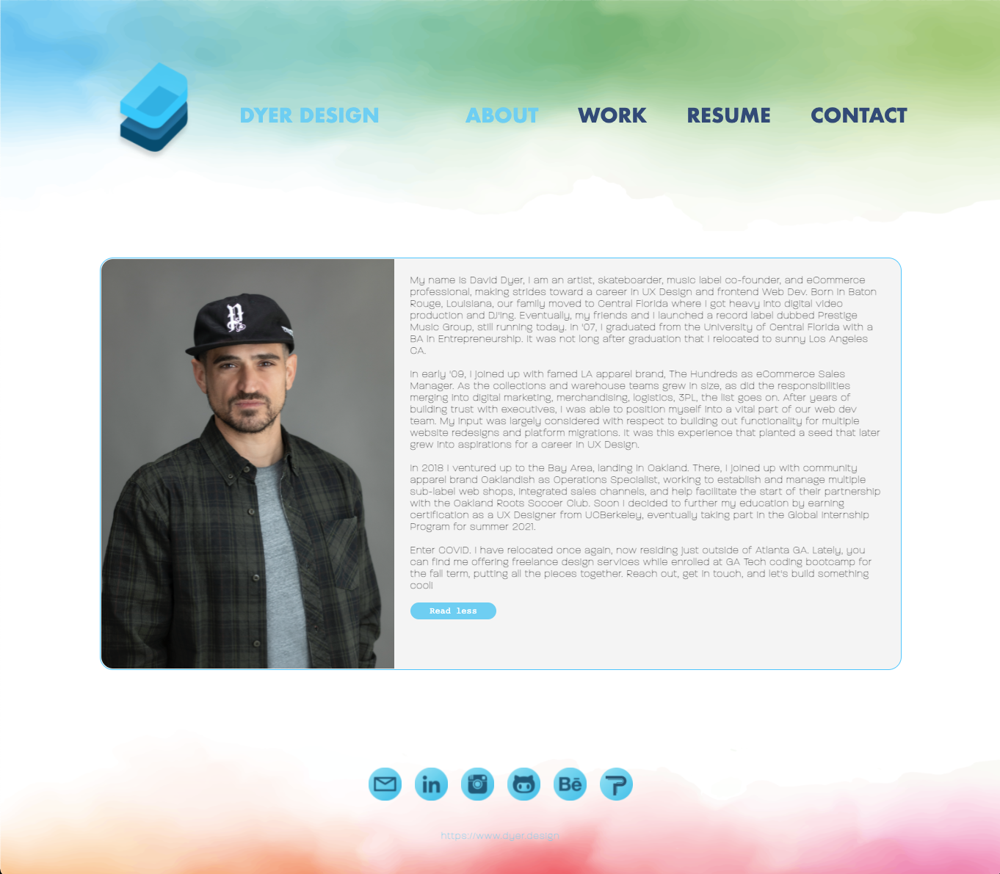

# react-to-this

<br />

## Table of Contents

- [Description](#description)
- [User Story](#user-story)
- [Deployment](#deployment)
- [License](#license)
- [Demo](#demo)
- [Criteria](#criteria)

<br />
<br />

## Description

Presenting a Web Development Portfolio using React as a Single Page Application. Users can navigate through About, Work, Resume, and Contact sections to guage skills and get in touch.

<br />
<br />

## User Story

```
AS AN employer looking for candidates with experience building single-page applications
I WANT to view a potential employee's deployed React portfolio of work samples
SO THAT I can assess whether they're a good candidate for an open position
```

<br />
<br />

## Deployment

Click to view in browser 🔗
<br/>
[](https://djdyer.github.io/react-to-this/)

<br />

**Employing the following technology:**

[](https://devdocs.io/html/)
[](https://devdocs.io/css/)
[](https://reactjs.org/)

<br />
<br />

## License

Copyright (c) David Dyer [2022]

[](https://choosealicense.com/licenses/isc/)

<br />
<br />

## Demo



<br />
<br />

## Criteria

✅

```
portfolio presents header, content, and footer sections.

header contains developer name + nav links for about, work, resume, contact.

content body defaults to highlighted about section with photo and biography.

user selects 'work' to see highlighted portfolio section containing 6 featured works.

each featured work contains image, title, links to repo and deployed.

user selects 'resume' to see a highlighted list of proficiencies, link to download pdf.

user selects 'contact' to see highlighted form to submit name, email, and message.

if moving cursor away from any input field, notification says feild required.

when entering email text, notification given if invalid.

footer contains icon links for github, linkedin, instagram.

```

<br />
<br />
Let's build something cool!  
<br/>     
🛠️
